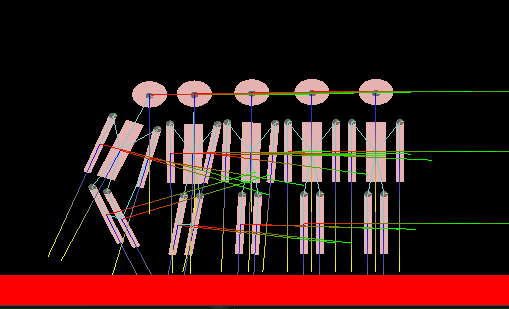

# MAVI-II

Este repositorio contiene las prácticas desarrolladas en la materia **Modelos y Algoritmos para Videojuegos II (MAVI II)**, que forma parte de la carrera de **Tecnicatura en Diseño y Programación de Videojuegos** en la **Facultad de Ingeniería y Ciencias Hídricas (FICH)** de la **Universidad Nacional del Litoral (UNL)**.

## Descripción
En este espacio se almacenan los ejercicios, proyectos y ejemplos trabajados durante el curso, orientados al aprendizaje de técnicas de programación y algoritmos aplicados al desarrollo de videojuegos.

## Más información
Para más detalles sobre la carrera y la universidad, visita el siguiente enlace:
[UNL - Tecnicatura en Diseño y Programación de Videojuegos](https://www.unl.edu.ar/carreras/tecnicatura-en-diseno-y-programacion-de-videojuegos-2)
